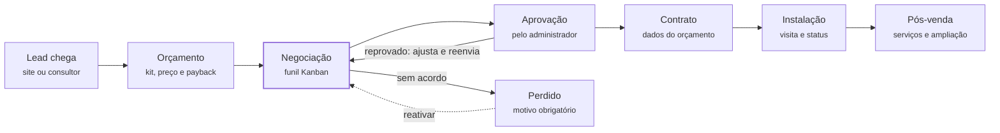

# CRM Solar — Guia completo da plataforma (Marketing, Site de Vendas e Treinamento)

Atualizado em 06/10/2026 · Versão compartilhada (editável): https://claude.ai/code/artifact/e73a6d61-022c-41ee-bef5-e492616b6f37

O CRM Solar organiza toda a venda de uma empresa de energia solar em um só lugar: do primeiro contato do lead até a usina instalada e o pós-venda. Este guia descreve cada função como ela existe hoje no sistema, para a equipe de marketing usar em divulgação, o time do site de vendas montar páginas e argumentos, e o treinamento ensinar o uso.

## 1. Visão geral e proposta de valor

**Em uma frase:** o CRM Solar transforma a conta de luz do cliente em uma proposta técnica e financeira pronta, e acompanha a negociação até o contrato assinado e a instalação concluída.

**O problema que resolve.** Empresas de energia solar costumam vender com planilhas de dimensionamento, propostas montadas à mão, WhatsApp sem registro e comissões calculadas fora do sistema. O resultado é proposta lenta, preço inconsistente entre vendedores, negociação esquecida e gestor sem visão do funil.

**O que o CRM Solar entrega:**

- **Proposta em minutos, com o cálculo certo.** O consultor informa o consumo e o sistema dimensiona a usina pela irradiação da cidade do cliente, sugere kits compatíveis, calcula o preço com as margens da empresa e mostra economia, payback e retorno do investimento.
- **Funil de vendas visual.** Um quadro Kanban mostra cada negociação, em que etapa está, há quanto tempo está parada e qual é o próximo contato.
- **Do orçamento ao contrato sem retrabalho.** Aprovação interna, contrato com os dados técnicos e o valor do orçamento aprovado, visita técnica, instalação e propostas de serviço pós-venda.
- **Gestão com números reais.** Dashboards, faturamento, comissões por consultor, previsão ponderada de vendas e auditoria de quem alterou o quê.
- **A cara da sua empresa.** Nome, logos, favicon e cores configuráveis pelo administrador (white label), aplicados em todas as telas, na tela de login e nos PDFs.

**Diferenciais para comunicar:**

| Diferencial | O que significa na prática |
| --- | --- |
| Feito para energia solar | Dimensionamento por grupo tarifário ANEEL (B1, B2, B3 e Grupo A), irradiação por município, kits fotovoltaicos e concessionárias já cadastrados |
| Preço sem erro | Precificação automática em 3 camadas de margem (por potência, por estado e por fornecedor); o consultor não digita preço de kit |
| Análise econômica para o cliente final | Economia mensal, payback simples e descontado, TIR, VPL e economia em 25 anos em cada proposta |
| Catálogo sempre atualizado | Integração com a distribuidora Edeltec sincroniza kits e preços automaticamente todos os dias |
| Funil que não deixa venda esfriar | Indicador de saúde de cada negociação, próximo passo obrigatório, caixa de entrada e WhatsApp com um clique |
| Controle e segurança | Dois perfis com áreas separadas, aprovação interna antes do contrato e registro de auditoria |

**Ciclo da venda no CRM Solar:**



A negociação no funil é o centro: dela o orçamento segue para aprovação e contrato, ou sai como perdido com motivo e pode ser reativado depois.

## 2. Para quem é

O público é a empresa integradora ou revendedora de energia solar com equipe comercial própria, do pequeno integrador com 2 ou 3 vendedores até operações regionais com vários consultores e clientes residenciais, comerciais, rurais e industriais.

**Perfis de empresa e o que cada um ganha:**

| Perfil da empresa | Dor típica | Como o CRM Solar ajuda |
| --- | --- | --- |
| Integrador pequeno (dono vende) | Proposta demora, preço é "de cabeça", follow-up esquecido | Dimensionamento e preço automáticos, PDF pronto, próximo contato no quadro |
| Empresa com equipe de consultores | Cada vendedor precifica de um jeito, gestor sem visão do funil | Margens centralizadas, aprovação interna, funil com todos os consultores e ranking |
| Operação regional (vários estados) | Tarifas, concessionárias e impostos mudam por estado | Concessionárias por estado, margem por estado, irradiação por município |
| Atendimento rural e industrial | Dimensionamento complexo (bombeamento, demanda, ponta e fora ponta) | Fluxos específicos para Grupo B2 rural e Grupo A (média e alta tensão) |

**Perfis de usuário dentro do sistema.** São dois, com áreas separadas; um usuário não enxerga a área do outro.

| Perfil | Quem é | O que faz no sistema |
| --- | --- | --- |
| Administrador | Dono, diretor, gerente comercial | Vê todas as negociações e consultores, aprova ou reprova orçamentos, controla preços e margens, catálogo, usuários, financeiro, integrações, configurações, identidade visual e auditoria |
| Consultor | Vendedor, representante comercial | Atende seus leads e clientes, dimensiona e gera orçamentos, conduz o funil, envia para aprovação, gera contratos, agenda visitas técnicas, cria propostas de serviço e acompanha as próprias comissões |

O consultor só vê os próprios clientes, leads, orçamentos e comissões. O cadastro de usuários é feito pelo administrador; não existe cadastro público.

## 3. Mapa de funcionalidades

São 18 módulos, organizados no menu lateral de cada perfil. A tabela diz o que cada um faz e quem usa.

| Módulo | Administrador | Consultor | O que faz |
| --- | --- | --- | --- |
| Dashboard | Sim | Sim | Indicadores do mês, evolução de vendas dos últimos 6 meses, orçamentos recentes; no admin, ranking dos consultores |
| Funil (Kanban) | Todos os consultores | Os próprios | Quadro visual das negociações por etapa, com arrastar e soltar |
| Orçamentos (lista) | Todos, com mudança de status | Os próprios, com criação | Lista filtrável, detalhes, itens, histórico e PDF da proposta |
| Dimensionamento | Não | Sim | Cria o orçamento: grupo tarifário, consumo, kit, preço e análise econômica |
| Clientes | Todos | Os próprios | Cadastro PF e PJ com busca de endereço pelo CEP |
| Leads | Todos, com atribuição | Os atribuídos a ele | Contatos recebidos do site e de outras origens, com status |
| Propostas de serviços | Não | Sim | Propostas avulsas: limpeza, manutenção, laudos, ampliações |
| Visitas técnicas | Não | Sim | Agenda e registro das visitas aos clientes |
| Contratos | Não | Sim | Gera o contrato do orçamento aprovado, com PDF |
| Financeiro | Comissões e faturamento | Extrato das próprias comissões | Valores das vendas aprovadas e comissão devida |
| Produtos | Sim | Não | Kits solares e catálogo de produtos avulsos, com categorias e marcas |
| Precificação | Sim | Não | Margens por faixa de potência, estado e fornecedor, com simulador de preço |
| Usuários | Sim | Não | Cadastro de administradores e consultores, com percentual de comissão |
| Fornecedores | Sim | Não | Distribuidoras de equipamentos |
| Integrações | Sim | Não | Sincronização do catálogo Edeltec e histórico de execuções |
| Configurações | Sim | Não | Auditoria, bancos, concessionárias, parâmetros de cálculo, funil, identidade visual e sistema |
| Perfil e senha | Sim | Sim | Dados pessoais e troca de senha |
| API pública da proposta | — | — | Endereço com chave única por orçamento que devolve os dados da proposta (sem documentos, custos nem margens) para exibir em um site ou aplicativo |

## 4. Funil de vendas (Kanban)

O funil mostra cada orçamento como um card numa coluna de etapa, e o consultor avança a venda arrastando o card. O gestor vê todas as negociações da equipe; o consultor, as dele.

**Etapas padrão** (nome, cor, ordem, probabilidade e prazo são configuráveis pelo administrador):

| Etapa | Probabilidade de fechar | Prazo esperado na etapa |
| --- | --- | --- |
| Primeiro contato | 10% | 2 dias |
| Proposta apresentada | 30% | 5 dias |
| Visita técnica | 50% | 7 dias |
| Negociação | 70% | 7 dias |
| Financiamento | 80% | 15 dias |
| Fechamento | 90% | 5 dias |
| Em aprovação (interna) | 95% | 2 dias |
| Ganho | 100% | — |
| Perdido | 0% | — |

**O que o usuário faz no quadro:**

- **Caixa de entrada.** Todo orçamento novo cai numa gaveta lateral até o consultor iniciar o atendimento. Os que esperam demais ganham o selo "esfriando".
- **Arrastar e soltar.** Mover entre etapas, enviar para aprovação (soltando em "Em aprovação") e, no caso do administrador, aprovar (soltar em "Ganho") ou reprovar (devolver para uma etapa). Funciona com mouse, toque e teclado, e também pelo menu de cada card.
- **Saúde da negociação.** Cada card tem um ponto colorido: verde (em dia), amarelo (contato hoje ou perto do prazo), vermelho (contato vencido ou prazo estourado) e cinza (sem próximo passo). Uma barra mostra quantos dias o card está na etapa contra o prazo.
- **Próximo contato.** Ao avançar uma negociação sem retorno agendado, o sistema pede a data. Registrar um contato guarda a conversa na linha do tempo e agenda o próximo.
- **Painel lateral.** Um clique no card abre os dados do cliente, itens, valores, próximo contato e a linha do tempo completa, sem sair do quadro.
- **WhatsApp e ligação com um clique.** Botões no card e no painel; depois do contato, o sistema oferece registrar a conversa.
- **Perda com motivo.** Ao marcar como perdido, o motivo é obrigatório (preço alto, sem retorno, crédito negado, fechou com concorrente e outros). Motivos "reativáveis" indicam depois quanto tempo vale voltar a falar com o cliente.
- **Reativar.** Uma negociação perdida volta ao funil com um clique, com contagem de tentativas.
- **Filtros e ordenação.** Busca instantânea por cliente ou número, filtros "atrasados", "sem próximo passo" e "prazo estourado", grupo tarifário, consultor (admin) e ordem por prioridade, valor ou tempo na etapa.
- **Desfazer.** Um movimento entre etapas pode ser desfeito por alguns segundos.
- **Ações em lote (admin).** Selecionar vários cards para mover, trocar o responsável ou marcar como perdidos.
- **Trocar o responsável (admin).** A negociação passa para outro consultor, junto com o percentual de comissão dele.

**Indicadores no topo do quadro:** valor em negociação, previsão ponderada (valor × probabilidade da etapa), contatos atrasados, negociações sem próximo passo e itens na caixa de entrada. Uma faixa colorida mostra quanto do valor total está em cada etapa.

**No celular,** o quadro vira uma etapa por vez, com abas para trocar de etapa.

**Argumento de venda:** "Nenhuma negociação fica esquecida: o sistema mostra quem está atrasado, quem está sem próximo passo e quanto dinheiro está parado em cada etapa."

## 5. Orçamentos e dimensionamento solar

O consultor escolhe o tipo de cliente, informa o consumo e recebe a usina dimensionada, os kits compatíveis com preço e a análise econômica, tudo calculado pelo sistema. Nenhum preço de kit é digitado à mão.

**Quatro fluxos, um para cada grupo tarifário da ANEEL:**

| Fluxo | Para quem | O que o consultor informa | O que o sistema considera a mais |
| --- | --- | --- | --- |
| Residencial (B1) | Casas e apartamentos | Consumo mensal, tarifa, ligação (mono, bi ou trifásica), objetivo de cobertura (50%, 75% ou 100%) | Custo de disponibilidade da concessionária (30, 50 ou 100 kWh) |
| Rural (B2) | Propriedades rurais | Consumo, tipo de instalação (residência rural, produtivo, irrigação), bombeamento | Consumo extra do bombeamento e kits de bombeamento solar |
| Comercial (B3) | Comércios e pequenas empresas | Consumo, horas de funcionamento, percentual de autoconsumo | Ligação bi ou trifásica, tensão 220 ou 380 V |
| Industrial (Grupo A: A4, A3a, A3, A2, A1) | Empresas com transformador próprio e demanda contratada | Consumo na ponta e fora da ponta, demanda, tarifas de energia e de demanda, modalidade horo-sazonal Verde ou Azul | Valor maior da energia gerada na ponta e estimativa de redução de demanda |

**Como o cálculo funciona (para explicar ao cliente):**

1. O sistema busca a **irradiação solar média da cidade do cliente** (base com os 5.571 municípios do país).
2. Aplica o **desempenho real do sistema** (perdas padrão de 20%, configuráveis) e o **fator de orientação do telhado** (norte, nordeste/noroeste, leste/oeste, sudeste/sudoeste, sul) e uma margem de segurança.
3. Calcula a **potência necessária em kWp** e procura kits ativos com potência compatível para a estrutura (telhado cerâmico, metálico, fibrocimento, laje, solo) e a tensão escolhidas, podendo usar mais de um kit em usinas grandes.
4. Para cada kit, mostra **geração mensal estimada**, **preço de venda** (custo do kit + margens da empresa) e a **análise econômica**.
5. Mostra também a **cobertura mês a mês** (geração × consumo ao longo do ano, com o pior e o melhor mês).

**Análise econômica exibida no orçamento:** economia por mês e por ano, composição da economia (consumo atendido, custo de disponibilidade que continua; no Grupo A, redução na ponta, fora da ponta e de demanda), payback simples e descontado, TIR, VPL e economia acumulada em 25 anos, com reajuste anual da tarifa e degradação dos painéis.

**Depois de salvar, o orçamento permite:**

- **Itens avulsos:** produtos do catálogo (string box, cabos, estrutura) ou serviços (projeto, ART, homologação), com o total recalculado. O sistema não deixa vender produto abaixo do custo.
- **Anotações** da proposta e técnicas.
- **PDF da proposta** com a marca da empresa: dados do cliente, resumo do sistema (potência, geração mensal, investimento, tipo de sistema), itens e observações.
- **Linha do tempo** com tudo o que aconteceu: criação, etapas, contatos, envio para aprovação, aprovação ou reprovação.
- **Envio para aprovação** do administrador (pelo orçamento ou pelo funil).

**Status do orçamento:** Novo → Em aprovação → Aprovado → Instalando → Finalizado (ou Aprovação reprovada, que volta para ajuste). Itens e preço só mudam enquanto o orçamento está em negociação; com contrato assinado, ele não volta para antes da aprovação.

**Argumento de venda:** "Do consumo na conta de luz à proposta com payback em poucos minutos, com o preço que a empresa definiu e a geração calculada para a cidade do cliente."

## 6. Aprovação, contrato, visitas e pós-venda

Depois da negociação, o orçamento passa por aprovação interna, vira contrato, recebe visita técnica e segue para instalação. O sistema registra cada passo e quem o fez.

**Aprovação interna.** O consultor envia o orçamento para aprovação; o administrador aprova (o orçamento vira venda ganha) ou reprova (volta para o consultor com o selo "Reprovado" e pode ser reenviado). A aprovação é uma checagem da empresa antes do contrato, não o aceite do cliente.

**Contrato.** Só é gerado a partir de orçamento aprovado, e cada orçamento tem um único contrato. Valor total, potência, geração estimada e consumo vêm do orçamento aprovado e não podem ser alterados no formulário. O consultor completa contratante, CPF ou CNPJ, endereço de instalação, quantidade de painéis e inversores, modelo do inversor, garantias, formas de pagamento e cláusulas adicionais. O contrato sai em PDF com a marca da empresa e espaço para as assinaturas. Status exibidos: gerado, assinado, cancelado.

**Visitas técnicas.** O consultor agenda visitas para os clientes (com data e hora, vinculadas ou não a um orçamento), acompanha a lista e marca como realizada ou cancelada, com anotações.

**Instalação.** O administrador muda o status do orçamento para Instalando e, ao concluir, para Finalizado. O dashboard mostra quantas usinas estão em instalação.

**Propostas de serviços (pós-venda).** Para gerar receita recorrente com quem já é cliente: limpeza de módulos, manutenção preventiva, ampliação do sistema, laudos. O consultor escreve a proposta a partir de modelos prontos (Instalação Solar, Manutenção Preventiva, Ampliação de Sistema), define valor e validade e acompanha o status: rascunho, enviada, aceita, recusada ou expirada. A tela mostra totais de propostas enviadas, aceitas e o valor aceito.

**Argumento de venda:** "A venda não termina no contrato: o CRM acompanha a instalação e ajuda a vender manutenção e ampliação para a base de clientes."

## 7. Clientes, leads e captação

Todo contato que chega vira um lead, o administrador distribui para um consultor, e o consultor converte em cliente com um clique quando a conversa avança.

**Leads.** Guardam nome, e-mail, telefone, cidade, estado, consumo mensal, origem (site, WhatsApp, indicação, Instagram, Google Ads, feira, API) e dados extras do formulário. O ciclo de status é: novo, encaminhado (atribuído a um consultor), contatado, convertido ou perdido. O administrador vê todos e atribui; o consultor vê os seus e atualiza o status. O botão **Converter em cliente** abre o cadastro já preenchido com nome, e-mail e telefone do lead.

**Clientes.** Cadastro de pessoa física (CPF, RG, nascimento) e jurídica (CNPJ, razão social), contatos e endereço completo com **busca automática pelo CEP** e cidade escolhida por estado, que define a irradiação solar usada no dimensionamento. A ficha do cliente reúne seus orçamentos e permite iniciar um novo. Busca por nome e filtro por status: novo, orçamento gerado, visita agendada, finalizado.

**Captação pelo site (para o time do site de vendas e dos sites dos clientes).** O CRM recebe leads de qualquer formulário externo por uma API pública:

| Item | Valor |
| --- | --- |
| Endereço | `POST https://<domínio-do-crm>/api/leads` |
| Formato | JSON ou formulário, com o cabeçalho `Accept: application/json` |
| Obrigatórios | `nome`, `email`, `telefone` |
| Opcionais | `cidade`, `estado` (UF com 2 letras), `consumo_mensal` (kWh), `origem` (ex.: `site`, `google-ads`; padrão `api`), `dados_extras` (objeto livre: UTM, valor da conta, mensagem) |
| Resposta | `201` com `{"message": "Lead recebido com sucesso.", "id": 123}`; `422` com os erros de validação |
| Proteções | Aceita envio de outros sites (sem token CSRF) e tem limite de envios por minuto contra abuso |

Exemplo de envio:

```bash
curl -X POST https://<domínio-do-crm>/api/leads \
  -H 'Accept: application/json' -H 'Content-Type: application/json' \
  -d '{"nome":"Maria Souza","email":"maria@exemplo.com","telefone":"(19) 99999-0000","cidade":"Campinas","estado":"SP","consumo_mensal":450,"origem":"site","dados_extras":{"utm_source":"google","valor_conta":420}}'
```

O CRM também expõe consultas públicas de apoio para formulários: `GET /api/cep/{cep}` (endereço pelo CEP), `GET /api/estados` e `GET /api/cidades/{UF}`.

**Argumento de venda:** "O lead do seu site cai direto no CRM, já com a origem da campanha, e chega ao consultor certo."

## 8. Indicadores, financeiro e comissões

O gestor acompanha volume, valor vendido e desempenho de cada consultor; o consultor vê as próprias metas e comissões. Venda conta como fechada quando o orçamento está aprovado, instalando ou finalizado.

**Dashboard do administrador:**

- Orçamentos do mês, comparados ao mês anterior
- Valor aprovado no mês e valor aprovado total
- Total de clientes, leads em aberto, consultores ativos e usinas em instalação
- Gráfico de evolução de vendas dos últimos 6 meses (quantidade e valor)
- Distribuição dos orçamentos por status
- Ranking dos 5 consultores com mais valor aprovado no mês
- Orçamentos mais recentes

**Dashboard do consultor:** os mesmos indicadores restritos à carteira dele (clientes, leads em aberto, orçamentos e valor aprovado no mês, orçamentos em aprovação e aprovados), evolução dos 6 meses, orçamentos e clientes recentes.

**Comissões.** Cada consultor tem um percentual de comissão definido pelo administrador. O percentual vigente é gravado em cada orçamento quando ele é criado; se o percentual mudar depois, os orçamentos antigos mantêm o anterior. A comissão não é somada ao preço do cliente: sai da margem da empresa.

- **Administrador:** lista de comissões das vendas fechadas, filtrável por consultor.
- **Consultor:** extrato com as próprias vendas fechadas e o total de comissões.

**Faturamento (administrador).** Lista das vendas fechadas com cliente e consultor, filtro por mês e ano e o total faturado.

**Previsão de vendas.** No funil, a previsão ponderada soma o valor de cada negociação multiplicado pela probabilidade da etapa em que ela está.

**Argumento de venda:** "Saiba hoje quanto vai vender no mês, quem está vendendo mais e quanto cada consultor tem a receber, sem planilha."

## 9. Produtos, kits e precificação

O administrador mantém o catálogo e as margens; o consultor só escolhe o kit, e o preço sai sozinho. Isso garante o mesmo preço para o mesmo sistema, qualquer que seja o vendedor.

**Kits solares** (os sistemas completos usados no dimensionamento): fornecedor, estrutura de fixação, potência em kWp, tensão (127, 220 ou 380 V), tipo de sistema (on-grid, off-grid, híbrido, bombeamento ou microinversor), preço de custo, componentes (painéis, inversor), SKU único por fornecedor e situação (ativo na empresa e disponível no fornecedor). Só kits ativos e disponíveis aparecem para o consultor.

**Catálogo de produtos avulsos:** painéis, inversores, transformadores, baterias, controladores de carga, bombas solares, iluminação solar, cabos e conectores, proteção elétrica e outros, com marcas, potência, garantia, ficha técnica e preço de custo. Abas para categorias e marcas e atalhos por categoria.

**Fornecedores:** cadastro das distribuidoras com contato e representante.

**Precificação em 3 camadas de margem.** O preço de venda de um kit é:

```latex
\text{Preço de venda} = \text{custo do kit} \times \text{quantidade} \times \left(1 + \frac{\text{margem por potência} + \text{margem do estado} + \text{margem do fornecedor}}{100}\right)
```

| Camada | Como funciona | Exemplo de uso |
| --- | --- | --- |
| Margem por faixa de potência | Faixas de kWp (ex.: 0 a 5, 5 a 10, acima de 100) com margens diferentes; faixas não podem se sobrepor | Margem maior em sistemas residenciais pequenos, menor em usinas grandes |
| Margem por estado | Uma margem para cada uma das 27 UFs, pela cidade do cliente | Compensar frete, impostos ou concorrência regional |
| Margem por fornecedor | Uma margem por distribuidora | Ajustar por condição comercial ou prazo de cada fornecedor |

A tela de precificação tem um **simulador**: informe preço de custo, potência total, estado e fornecedor e veja na hora cada margem aplicada e o preço final. Todas as alterações de margem e de preço de kit ficam registradas na auditoria.

**Argumento de venda:** "Defina a política de preço uma vez: o sistema aplica em todas as propostas, por potência, por estado e por fornecedor."

## 10. Integrações, configurações e identidade visual

O administrador ajusta o sistema à realidade da empresa sem depender de programador: catálogo sincronizado, tarifas, parâmetros de cálculo, funil e a marca.

**Integração Edeltec.** Sincroniza o catálogo de kits e os preços da distribuidora Edeltec automaticamente todos os dias às 4h, ou na hora pelo botão "Integrar". Kits novos entram, preços mudam e kits retirados pelo fornecedor deixam de aparecer para os consultores. O histórico mostra cada execução: início, duração, itens importados, atualizados e desativados, avisos (ex.: SKU com preço zerado) e falhas. As credenciais da API ficam no servidor.

**Configurações:**

| Tela | O que se configura |
| --- | --- |
| Concessionárias | Distribuidoras de energia por estado e suas tarifas (convencional, ponta, intermediária, fora da ponta); 33 já vêm cadastradas |
| Dimensionamento | Perdas do sistema, margem de segurança do dimensionamento e perdas por orientação do telhado |
| Funil de vendas | Etapas (nome, cor, ordem, probabilidade, prazo, ativa), motivos de perda (reativável e em quantos dias) e parâmetros (dias até a caixa de entrada "esfriar", máximo de tentativas de reativação) |
| Bancos | Linhas de financiamento (juros ao mês, parcelas, carência) como referência para a equipe |
| Sistema | Dados da empresa usados nos PDFs (nome, telefone, e-mail) e demais parâmetros gerais |
| Identidade visual | Marca da plataforma (abaixo) |
| Auditoria | Consulta de quem alterou o quê (seção 11) |

**Identidade visual (white label).** O administrador define:

- nome da plataforma (título das abas, menu, tela de login e e-mails do sistema);
- logo do menu (exibida em um avatar redondo), logo para fundo claro (tela de login e PDFs) e favicon;
- cor primária (botões, links, destaques), cor secundária e as cores de fundo e de fonte do menu lateral;
- texto do rodapé da tela de login.

A tela tem pré-visualização ao vivo do menu, dos botões e da tela de login, avisa quando a fonte do menu fica ilegível sobre o fundo e permite restaurar o padrão com um clique. Abaixo do nome da plataforma, o menu mostra a função de quem está logado (Administrador ou Consultor).

**Argumento de venda:** "Sua marca, suas cores, seu catálogo e sua política comercial, configurados pelo próprio gestor."

## 11. Segurança, permissões e auditoria

Cada usuário só vê e altera o que é dele, as regras de negócio são checadas no servidor e toda alteração importante fica registrada com autor e data.

**Acesso e permissões:**

- Duas áreas separadas (administrador e consultor); um perfil não abre as telas do outro.
- O consultor só acessa os próprios clientes, leads, orçamentos, contratos, visitas e comissões, mesmo que tente digitar o endereço de um registro alheio.
- Não há cadastro público: só o administrador cria usuários.
- Usuário desativado não entra, e quem já estava logado é desconectado. O administrador não consegue excluir nem desativar a si mesmo.
- Tentativas de login são limitadas, e as APIs públicas têm limite de requisições por minuto.

**Regras que protegem a operação:**

- Preço e geração do orçamento são calculados no servidor, não aceitos do navegador.
- Produto avulso não pode ser vendido abaixo do custo; kit inativo não entra em proposta.
- Contrato só nasce de orçamento aprovado, uma vez só, com o valor do orçamento.
- Mudanças de status seguem um caminho permitido (ex.: venda com contrato não volta para negociação).
- A API pública da proposta não expõe CPF, RG, custo, margem nem comissão.

**Auditoria** (Configurações → Auditoria). Registra quem fez, quando e o valor antes e depois em: orçamentos e seus itens, clientes, leads, contratos, visitas, propostas de serviço, margens das 3 camadas, preço e disponibilidade de kits e produtos, concessionárias, parâmetros de dimensionamento, etapas e motivos do funil, usuários (nome, e-mail, perfil, status e comissão; senha nunca é registrada) e identidade visual. Filtros por tipo de registro, usuário e tipo de evento (criação, alteração, exclusão).

**Argumento de venda:** "Cada consultor vê só a própria carteira, e o gestor sabe exatamente quem mudou um preço, uma margem ou um status."

## 12. Demonstração: modo demo e base fictícia

O prospect pode explorar a plataforma sozinho, sem senha e sem risco, numa empresa fictícia com 16 meses de operação. Cada acesso vira um lead para a equipe comercial. O ambiente está ativo em https://crmsolar.rexar.com.br desde 06/10/2026.

**O que o visitante vive:**

1. Abre o link e preenche nome, e-mail e/ou WhatsApp, empresa (opcional) e o aceite de contato.
2. Entra direto, sem senha, como **Administrador**. Um aviso de boas-vindas explica que os dados são fictícios.
3. Uma barra fixa no rodapé ("Modo demonstração — Ver como: Administrador · Consultor") troca de perfil com um clique.
4. Navega por tudo: dashboards, funil, orçamentos, contratos, financeiro, configurações. Pode rodar o simulador de dimensionamento e ver kits, preço e payback.
5. Botões que gravariam algo ficam esmaecidos; se clicar, aparece "Acesso de teste: criar, editar e excluir estão desativados nesta demonstração". O bloqueio é feito no servidor: nada é gravado nem por chamadas diretas.

**O que a empresa fictícia tem** ("Sol Nascente Energia Solar"): 11 usuários (2 administradores e 9 consultores, um deles desligado e um recém-contratado), cerca de 620 clientes em 29 cidades de SP, MG, GO e PR, cerca de 630 leads, cerca de 600 orçamentos de todos os grupos tarifários, mais de 200 contratos, visitas, propostas de serviço, auditoria e histórico de integração. Os números crescem mês a mês e sempre há trabalho pendente "hoje". Todo nome aparece com "(fictício)", documentos e telefones são impossíveis e os PDFs saem com a faixa "Documento de demonstração com dados fictícios".

**Como o marketing usa:**

| Uso | Como |
| --- | --- |
| Link em campanha | `https://crmsolar.rexar.com.br/login?utm_source=<canal>&utm_medium=<formato>&utm_campaign=<campanha>`; os UTMs ficam gravados no visitante |
| Exemplos | `?utm_source=linkedin&utm_medium=post&utm_campaign=lancamento` · `?utm_source=whatsapp&utm_campaign=indicacao` · `?utm_source=google&utm_medium=cpc&utm_campaign=crm-solar` |
| Lista de visitantes | Planilha CSV no endereço `/demo/visitantes.csv?token=<chave>` (a chave fica com a liderança técnica) ou o comando `php artisan demo:visitantes` |
| Colunas da lista | Nome, e-mail, telefone, empresa, primeiro e último acesso, visitas, telas vistas, perfis usados, utm\_source, utm\_medium, utm\_campaign |
| Priorização comercial | Quem tem mais visitas e mais telas vistas, e quem testou os dois perfis, está mais engajado |

**Cuidados:** com o modo ligado, ninguém consegue gravar nada nesse ambiente, nem a equipe interna, e o formulário externo de leads também fica bloqueado. A identidade visual precisa ser configurada antes de ligar o modo. As datas da base são relativas ao dia em que ela foi gerada; para os gráficos acompanharem o calendário, a base deve ser renovada periodicamente, exportando antes a lista de visitantes. O passo a passo técnico está no arquivo `DEMO.md` do projeto.

## 13. Mensagens-chave, argumentos e objeções

A promessa central é vender mais rápido e com preço certo, sem perder negociações. Os textos abaixo podem ser usados como estão ou adaptados; nenhum cita resultado numérico que o sistema não comprova. Ganhos como "reduz X% o tempo" só devem ser usados depois de medidos com clientes reais.

**Opções de slogan:**

- "Da conta de luz ao contrato assinado, em um só sistema."
- "O CRM feito para quem vende energia solar."
- "Proposta certa em minutos. Nenhuma venda esquecida."

**Mensagens por público:**

| Público | Mensagem principal | Provas no produto |
| --- | --- | --- |
| Dono ou diretor | Controle total do comercial e da margem | Precificação em 3 camadas, aprovação interna, dashboards, auditoria |
| Gerente comercial | Veja o funil inteiro e aja antes de perder a venda | Kanban com saúde das negociações, atrasados, previsão ponderada, ações em lote |
| Consultor | Mais tempo vendendo, menos tempo em planilha | Dimensionamento automático, PDF pronto, WhatsApp com um clique, extrato de comissões |
| Operação técnica | Do contrato à instalação sem retrabalho | Contrato com dados do orçamento aprovado, visitas, status de instalação |

**Respostas para objeções comuns:**

| Objeção | Resposta |
| --- | --- |
| "Já uso planilha de dimensionamento" | A planilha calcula, mas não aplica sua política de preço, não gera proposta, não acompanha o follow-up nem calcula comissão. Aqui tudo isso sai do mesmo cálculo. |
| "Minha equipe não vai usar" | O consultor trabalha num quadro visual, arrasta cards e fala com o cliente pelo WhatsApp a partir do card. A demonstração mostra isso sem instalar nada. |
| "Meu fornecedor não é a Edeltec" | Kits e produtos de qualquer fornecedor podem ser cadastrados; a Edeltec tem sincronização automática diária. |
| "Atendo cliente rural e industrial" | Há fluxos próprios para Grupo B2 rural (com bombeamento) e Grupo A (ponta, fora da ponta, demanda, horo-sazonal Verde e Azul). |
| "Cada vendedor dá um preço" | O consultor não digita preço de kit: o preço vem das margens definidas pelo gestor, e o orçamento passa por aprovação antes do contrato. |
| "E a segurança dos dados?" | Cada consultor vê só a própria carteira, há registro de auditoria e as APIs públicas não expõem documentos nem custos. |
| "Quero com a minha marca" | Nome, logos, favicon e cores são configurados pelo próprio administrador e aparecem nas telas, no login e nos PDFs. |
| "Funciona no celular?" | Sim, no navegador do celular; o funil tem uma visão própria por etapas. Não há aplicativo nas lojas. |

## 14. Recomendações para o site de vendas

O site deve levar o visitante para a demonstração: é a prova mais forte e já captura o lead com a origem da campanha. Todo botão principal aponta para o link da demo com UTM.

**Estrutura de páginas sugerida:**

1. **Início:** slogan, uma frase de proposta de valor, imagem do funil ou do dimensionamento, botão "Ver a plataforma por dentro" (demo).
2. **Como funciona:** os 5 passos da venda no CRM: lead chega → orçamento dimensionado → negociação no funil → aprovação e contrato → instalação e pós-venda.
3. **Funcionalidades:** um bloco por módulo das seções 4 a 11 deste guia, cada um com título, duas linhas e uma imagem da tela.
4. **Para quem é:** os perfis da seção 2 (integrador pequeno, equipe de consultores, operação regional, rural e industrial).
5. **Sua marca:** identidade visual configurável, com antes e depois.
6. **Segurança e controle:** permissões, aprovação interna e auditoria.
7. **Perguntas frequentes:** a partir da seção 13 e da seção 16.
8. **Contato:** formulário e WhatsApp da equipe comercial.

**Chamadas para ação (CTAs):** "Ver a plataforma por dentro", "Acessar a demonstração sem senha", "Testar o dimensionamento", "Falar com um especialista".

**Imagens a capturar no ambiente de demonstração** (dados fictícios, sem risco de expor clientes):

| Tela | Perfil | O que mostrar |
| --- | --- | --- |
| Funil (Kanban) | Administrador | Colunas cheias, pontos de saúde, faixa de valor por etapa |
| Painel lateral do card | Consultor | Linha do tempo, botões de WhatsApp e ligação |
| Dimensionamento B1 | Consultor | Lista de kits com preço, geração e payback |
| Análise econômica | Consultor | Economia mensal, payback, TIR, cobertura mês a mês |
| Dashboard | Administrador | Evolução de 6 meses e ranking de consultores |
| Precificação | Administrador | Faixas de margem e simulador |
| PDF da proposta | Consultor | Proposta com a marca da empresa |
| Identidade visual | Administrador | Pré-visualização com outras cores e logo |
| Celular | Consultor | Funil por etapas no celular |

**Palavras-chave para SEO e anúncios:** CRM para energia solar, software para integrador solar, sistema de orçamento fotovoltaico, dimensionamento de energia solar, proposta de energia solar, gestão de vendas solar, funil de vendas energia solar, cálculo de payback solar, CRM fotovoltaico, gestão de comissões de vendedores solares.

**Pendências para o time do site:** preço e planos do produto, domínio definitivo da demonstração e canal de atendimento comercial não estão definidos no sistema e precisam vir da liderança.

## 15. Roteiros de demonstração e trilhas de treinamento

Uma demonstração comercial completa leva cerca de 20 minutos e alterna os dois perfis pela barra de demonstração. As trilhas de treinamento seguem a ordem em que cada perfil usa o sistema no dia a dia.

**Roteiro de demonstração comercial (cerca de 20 minutos):**

1. **Dashboard do administrador (2 min):** valor aprovado no mês, evolução de 6 meses, ranking de consultores, usinas em instalação.
2. **Funil (4 min):** faixa de valor por etapa, cards vermelhos (atrasados) e cinzas (sem próximo passo), filtro "Atrasados", painel lateral de um card com a linha do tempo.
3. **Trocar para Consultor (1 min):** mostrar que ele vê só a própria carteira.
4. **Novo orçamento B1 (5 min):** escolher um cliente, informar o consumo, calcular, comparar kits, abrir a análise econômica e a cobertura mês a mês. Na demo o salvamento é bloqueado; usar um orçamento existente para os próximos passos.
5. **Orçamento existente (3 min):** itens, linha do tempo, PDF da proposta com a marca.
6. **Contrato e pós-venda (2 min):** contrato de um orçamento ganho, visitas técnicas e propostas de serviço.
7. **Voltar a Administrador (3 min):** precificação com o simulador, identidade visual com a pré-visualização, auditoria.
8. **Fechamento:** reforce as três mensagens: preço certo, nenhuma venda esquecida, controle do gestor.

**Trilha de implantação do administrador (ordem recomendada):**

1. Identidade visual: nome, logos, favicon e cores.
2. Sistema: nome, telefone e e-mail da empresa para os PDFs.
3. Concessionárias: conferir tarifas dos estados atendidos.
4. Dimensionamento: conferir perdas e margem de segurança.
5. Fornecedores e catálogo: ativar a integração Edeltec e/ou cadastrar kits e produtos.
6. Precificação: faixas por potência, margens por estado e por fornecedor; validar no simulador.
7. Funil de vendas: etapas, prazos e motivos de perda da empresa.
8. Usuários: cadastrar consultores com o percentual de comissão.
9. Rotina: aprovar orçamentos em "Em aprovação", distribuir leads, acompanhar o funil e o dashboard, atualizar status de instalação.

**Trilha do consultor (rotina diária):**

1. Abrir o funil e tratar primeiro os cards vermelhos (atrasados) e a caixa de entrada.
2. Ver os leads encaminhados, fazer o primeiro contato e converter em cliente.
3. Cadastrar o cliente com CEP e cidade corretos (a cidade define a irradiação).
4. Criar o orçamento no fluxo do grupo tarifário, comparar kits e salvar.
5. Gerar o PDF, apresentar ao cliente e registrar o contato com a próxima data.
6. Avançar o card a cada etapa; agendar visita técnica quando necessário.
7. Enviar para aprovação; com o orçamento aprovado, gerar o contrato.
8. Acompanhar o extrato de comissões e oferecer serviços de pós-venda aos clientes instalados.

**Boas práticas para treinar:** todo card com próximo contato agendado; motivo de perda sempre preenchido com observação; cidade do cliente sempre correta; nunca combinar preço fora do sistema.

## 16. Perguntas frequentes, glossário e limites atuais

**Perguntas frequentes:**

| Pergunta | Resposta |
| --- | --- |
| Preciso instalar algo? | Não: o sistema funciona no navegador, no computador e no celular. |
| Posso mudar as etapas do funil? | Sim: nome, cor, ordem, probabilidade e prazo de cada etapa, além dos motivos de perda. |
| Como a comissão é calculada? | Valor de venda de cada item × percentual do consultor gravado no orçamento, contando as vendas aprovadas, em instalação e finalizadas. |
| O preço do kit muda sozinho? | Muda quando o custo do kit muda (pela integração Edeltec ou pelo cadastro) ou quando o gestor altera as margens; orçamentos já salvos mantêm o preço. |
| Funciona para todo o Brasil? | A irradiação cobre os 5.571 municípios e há 33 concessionárias de todos os estados cadastradas. |
| Dá para receber leads do meu site? | Sim, pela API pública de leads (seção 7). |

**Glossário:**

| Termo | Significado |
| --- | --- |
| kWp (quilowatt-pico) | Potência máxima da usina solar em condições padrão; define o tamanho do sistema |
| Irradiação / HSP | Quantidade média de sol por dia na cidade, em horas de sol pleno; define quanto a usina gera |
| Grupo tarifário | Classificação da ANEEL: B1 residencial, B2 rural, B3 comercial (baixa tensão) e Grupo A (média e alta tensão) |
| Ponta e fora da ponta | Horários de tarifa mais cara e mais barata no Grupo A |
| Demanda contratada | Potência que a empresa do Grupo A contrata com a concessionária e paga mesmo sem usar |
| Horo-sazonal Verde / Azul | Modalidades de tarifa do Grupo A; a Azul cobra demanda separada na ponta e fora dela |
| Custo de disponibilidade | Consumo mínimo cobrado mesmo com usina (30, 50 ou 100 kWh conforme a ligação) |
| Payback | Tempo para a economia pagar o investimento (simples ou descontado pela taxa de juros) |
| TIR e VPL | Taxa de retorno do investimento e valor presente do ganho em 25 anos |
| On-grid, off-grid, híbrido | Ligado à rede, isolado com baterias, ou os dois |
| Prazo da etapa (SLA) | Tempo esperado de uma negociação em cada etapa do funil; acima dele o card fica vermelho |
| Previsão ponderada | Soma do valor de cada negociação × a probabilidade da etapa em que está |

**Limites atuais (não prometer na divulgação):**

| Ponto | Situação hoje |
| --- | --- |
| Análise econômica no PDF | Aparece na tela do orçamento; o PDF traz resumo do sistema, itens e observações, sem payback e economia |
| Assinatura de contrato | O contrato sai em PDF para assinatura fora do sistema; não há assinatura eletrônica nem tela para marcar o contrato como assinado ou cancelado |
| Visitas técnicas | O formulário pede tipo e endereço da visita, mas esses dois campos ainda não são gravados (defeito a corrigir) |
| Financiamento | Bancos e linhas são só cadastro de referência; não há simulação de parcelas na proposta |
| Integrações | Sincronização automática só com a Edeltec; demais fornecedores por cadastro |
| Comunicação com o cliente | O sistema abre a conversa no WhatsApp e a ligação, mas não envia mensagens nem e-mails automáticos |
| Proposta on-line | Existe a API pública com os dados da proposta, mas não uma página pronta para o cliente abrir |
| Aplicativo | Não há aplicativo nas lojas; o uso no celular é pelo navegador |
| Funil, próximas fases | Planejados e ainda não disponíveis: fila de recuperação de negociações paradas e perdidas, métricas de conversão por etapa, "contatos de hoje" no dashboard, atividades detalhadas e automações |
| Outros | Não há tickets de suporte, notificações internas nem relatório de acessos |
